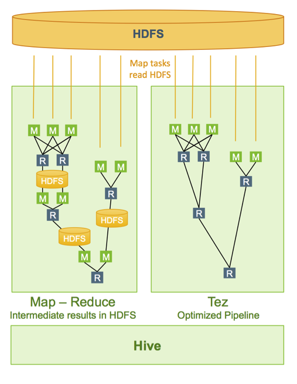
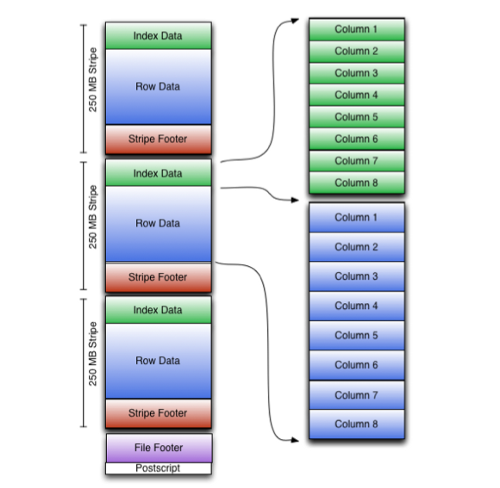

# Hive Optimization
There are several types of Hive Query Optimization techniques are available while running hive queries to improve performance.
Including:
- Execution Engine
- Usage of Suitable File Format
- Hive Partitioning
- Bucketing in Apache Hive
- Vectorization in Hive
- Cost-Based Optimization in Hive
- Hive Indexing
  
## Partitioning
Partitioning divides the table into parts based on the values of particular columns.
### Advantages
- easy to do queries on slices of the data
- only relevant data is read for the execution of a particular job, decreasing the I/O time required by the query

### Partitioning type
- Static
  This is practiced when we have knowledge about the partitions of data we are going to load. It should be preferred when loading data in a table from large file
  ```
  set hive.mapred.mode = strict;
  ```
- Dynamic
  It is used when we do not have knowledge about the partitions of the data. It takes more time to load data in the table.
    ```
    SET hive.exec.dynamic.partition = true;
    ```
    - strict: At least one column to be static while loading the data
    
    - Noe-strict: dynamic values of all the partition columns

```
Hive.exec.max.dynamic.partitions.pernode: Maximum number of partitions to be created in each mapper/reducer node
Hive.exec.max.dynamic.partitions: Maximum number of dynamic partitions allowed to be created in total
Hive.exec.max.created.files: Maximum number of HDFS files created by all mappers/reducers in a MapReduce job
Hive.error.on.empty.partition: Whether to throw an exception if the dynamic partition insert generates empty results
```

## Bucketing
Bucketing provides flexibility to further segregate the data into more manageable sections called buckets or clusters. **CLUSTERED BY** clause is used to divide the table into buckets.
```
CREATE TABLE table_name (column1 data_type, column2 data_type, …) PARTITIONED BY (partition1 data_type, partition2 data_type,….) CLUSTERED BY (clus_col1) SORTED BY (sort_col2) INTO n BUCKETS;
```

**In Hive Partition, each partition will be created as a directory. But in Hive Buckets, each bucket will be created as a file**
```
set hive.enforce.bucketing = true;
```
## Tez-Execution Engine in Hive
Tez Execution Engine – Hive Optimization Techniques, to increase the Hive performance of our hive query by using our execution engine as Tez.
```
SET hive.execution.engine=tez;
```
- Execute complex-directed acyclic graphs of general data processing tasks. 
- Combine the MapReduce task as a node of DAG, enforcing concurrency and serialization.
    

## Usage of Suitable File Format in Hive
**ORCFILE** File Formate - Hive Optimization Techniques.
Here, ORC refers to Optimized Row Columnar which tore data in an optimized way. The ORC storage strategy is both column-oriented and row-oriented. An ORC format file consists of tabular data that is written in “stripes” of a convenient size to process in a single mapper.

- **Striper** contains a directory stream locations.
- **Row Data** used in table scans, default contains 10000 rows.
- **Index Data** include min and max values for each column and row positions within each column.

### Command
```
CREATE TABLE ... STORED AS ORC
ALTER TABLE ... [PARTITION partition_spec] SET FILEFORMAT ORC
SET hive.default.fileformat=Orc
```
### Advantages
- Achieves higher level of compression, the compression algorithm can be changed using orc.compress setting in the hive. By default, it uses Zlib Compression.
- It has the ability to skip scanning an entire range of rows within a block, if irrelevant to the query, using the light-weight indexes stored within the file.
- It has the ability to skip decompression of rows within a block, if irrelevant to the query.
Single file as the output of each task, reducing the load on the name node.
- It supports multiple streams to read the file simultaneously.
- It keeps the metadata stored in the file using Protocol Buffers, used for serializing structured data.

## Vectorization
A standard query execution system processes one row at a time. Vectorized query execution streamlines operations by processing a block of 1024 rows at a time. So if your table have 5000 rows in the table and you are trying to do some string based filtering on some column, then you will see INPUT_RECORDS_PROCESSED is only 5.
```
SET hive.vectorized.execution=true;
SET hive.vectorized.execution.enabled=true;
```

## Predicate push down

```
SET hive.optimize.ppd=true;
```
Basic idea of predicate pushdown is that, predicates of SQL query can be pushed closer to where the data lives.
```
select a.*, b.* from a join b on (a.col1 = b.col1)
where a.col1 > 20 and b.col2 > 40
```
With predicate pushdown, predicates (where condition) will be pushed further up in the query(while reading the data).if we have predicate pushdown enabled, first the filtering on both the table will happen and then the join will be performed with smaller data set.In absence of predicate pushdown it will first join the two tables and then do the filter the rows on where condition.

## Use of Single scan
```
FROM source_table
INSERT INTO target_table_1 SELECT * WHERE ATTRIBUTE1=XYZ
INSERT INTO target_table_2 SELECT * WHERE ATTRIBUTE1=PQR
```
In the above statement the table is read only once, if we do it in two separate insert it will read the table twice.

## Enable compression of intermediate data
```
SET hive.exec.compress.intermediate=true;
SET hive.intermediate.compression.codec =org.apache.hadoop.io.compress.SnappyCodec;
SET hive.intermediate.compression.type=BLOCK;
```
Setting the above parameter compresses the Hive’s intermediate data before writing it out.

## Join Optimization
See [Hive_join](Hive_join.md)

## Cost-based Optimizations
The CBO lets hive optimize the query plan based on the metadata gathered. It Generates effective execution plan by scanning query. It converts queries into operator tree and assigns cost to operators and finally selects the plan having lowest cost. You should generate column statistics for tables.CBO provides two types of optimizations: logical and physical.

### Logical Optimization
- Projection Pruning
- Deducing Transitive Predicates
- Predicate Pushdown
- Merging of Select-Select, Filter-Filter into a single operator
- Multi-way Join
- Query Rewrite to accommodate for Join skew on some column values

### Physical Optimization
- Partition Pruning
- Scan pruning based on partitions and bucketing
- Scan pruning if a query is based on sampling
- Apply Group By on the map side in some cases
- Optimize Union so that union can be performed on map side only
- Decide which table to stream last, based on user hint, in a multiway join
- Remove unnecessary reduce sink operators
- For queries with limit clause, reduce the number of files that needs to be scanned for the table.

```
SET hive.cbo.enable=true;
SET hive.compute.query.using.stats=true;
SET hive.stats.fetch.column.stats=true;
SET hive.stats.fetch.partition.stats=true;
```

## Reference
1. [Apache Hive Optimization Techniques - 1](https://towardsdatascience.com/apache-hive-optimization-techniques-1-ce55331dbf5e)
2. [Apache Hive Optimization Techniques - 2](https://towardsdatascience.com/apache-hive-optimization-techniques-2-e60b6200eeca)
3. [7 Best Hive Optimization Techniques – Hive Performance](https://data-flair.training/blogs/hive-optimization-techniques)
