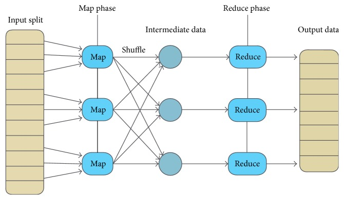

# Data Distribution in Big Data

## Data skew
Data skew means that data distribution is uneven or asymmetric. Symmetric means that one half of the distribution is a mirror image of the other half.

Skewed distribution may be different types:
- left skewed distribution - has a long left tail. Left-skewed distributions are also called negatively-skewed distributions.
- right skewed distribution - has a long right tail. Right-skewed distributions are also called positive-skew distributions.

### skewness
Skewness is a measure of symmetry, or more precisely, lack of symmetry. Skewness calculates via the formula:

$$
skewness = \frac{3 * (mean - median)}{standard deviation}
$$
where:
$$
standard deviation = \frac{\sum_{i=1}^{n}(x_i-mean)^2}{n-1}
$$

## Data skew in distributed system
### MapReduce
MapReduce is a parallel, distributed computation paradigm. MapReduce provide two main operations: map and reduce.


Due to uneven data distribution, a large amount of data is concentrated to one point, causing data hot spots. During the execution of the task, the task progress was maintained at about 99% for a long time. Checking the task monitoring page, it was found that only a few (1 or several) reduce subtasks were not completed. Because the amount of data processed is too different from other reduce.

### Example
Suppose we have two tables *customers* and *orders*, and we want to join these two tables to get a full orders list for each customer. It should note that some of customers are very active (regular customers with much orders) and some of them are very passive(few orders).

For this example, the map reduce will split customers into different nodes. the node with active customer will spend much longer time to do the job, more than other nodes.

## Reasons for Data Skew
- uneven data distribution
- the characteristics of the business data itself
- Inadequate consideration when building the table
- Some SQL statements themselves have data skew

## General Solution

1. Splitting data for more processors
2. Set more partitions for overcrowded columns

### Skewed storing
Reduce data skew effect at the data uploading stage.
#### main concepts
- can be implemented before processing phase
- increasing the speed of computing
  
### Repartitioning
Divide key that have overcrowded values quantity into more than one mapper.

#### Main concepts

- can be implemented between processing phases
- number of mappers equals to number of partitions
- custom partition strategy could be set

## Out of The Box Solutions

### Hive - Skewed Table 
Skewed Table is a table which has skewed information.Values that appear very often (heavy skew) are split out into separate files and rest of the values go to some other file.

### Hive - List Bucketing
The special type of skewed table. Main idea - maintaining one directory per skewed key. The data corresponding to non-skewed keys goes into **separate directory**.
The basic idea here is as follows: Identify the keys with a high skew. Have one directory per skewed key, and the remaining keys go into a separate directory. This mapping is maintained in the metastore at a table or partition level, and is used by the Hive compiler to do input pruning. The list of skewed keys is stored at the table level.

**List Bucketing Table** is a skewed table. In addition, it tells Hive to use the list bucketing feature on the skewed table: create sub-directories for skewed values.

#### Command
```
CREATE TABLE <T> (SCHEMA) SKEWED BY (keys) ON ('c1', 'c2') [STORED AS DIRECTORIES];
```
*STORED AS DIRECTORIES* is an optional parameter. It tells Hive it is not only a skewed table but also the list bucketing feature should apply: created sub-directories for skewed value.

#### Example
For example, the table maintains the list of skewed keys for 'x': 6, 20, 30, 40. When a new partition is being loaded, it will create 5 directories (4 directories for skewed keys + 1 default directory for all the remaining keys). The table/partition that got loaded will have the following mapping: 6,20,30,40,others. This is similar to hash bucketing currently, where the bucket number determines the file number. Since the skewed keys need not be consecutive, the entire list of skewed keys need be stored in each table/partition.

##### Good under assumptions
- Each partition's skewed key account for a significant percentage of the total data. In the above example, if the skewed keys (6,20,30 and 40) only occupy a small percentage of the data (say 20%), the queries of the form x=50 will still need to scan the remaining data (~80%).
- The number of skewed keys per partition is fairly small. This list is stored in the metastore, so it does not make sense to store 1 million skewed keys per partition in the metastore.

##### Not scale in scenarios
- The number of skewed key is very large.
- In most of the cases, the number of clustered keys is more than one, and in the query, all the clustered keys are not specified.

### Map-side aggregation
```
--Map end partial aggregation, equivalent to Combiner
hive.map.aggr = true；
-Load balancing when there is data skew
hive.groupby.skewindata=true；
```
### Skewed Join
1. Regarding the selection of the driving table, use the table with the most uniform join key distribution as the driving table
2. Separate Queries
    ```
    # query 1
    select A.id from A join B on A.id = B.id
    # query 2
    select A.id from A join B on A.id = B.id where A.id <> 1;
    select A.id from A join B on A.id = B.id where A.id = 1 and B.id = 1;
    ```
    Now, assume A was high skewed in favor of id=1. Reduced R2 and R3 will complete quickly but R1 will continue a long time, thus becoming the bottleneck. 
    assume B has few rows with B.id = 1, it will fit into memory. So the join can be done by the  Mapper efficiently without Reducer.
3. Divide skew data to different Reducer. Set NA value to string + random_number
4. group by dimension is too small. Use sum() group by to replace count(distinct) to complete the calculation.
5. Special handing for special circumstances

### Data replication
if we want to join unskewed table to skewed table:
- unskewed table: replicate N times and add a new key 0-N.
- skewed table: add to existing key a random, uniformly distributed value 0 - N.  
### Reference
1. [ListBucketing-SkewedTable vs ListBucketingTable](https://cwiki.apache.org/confluence/display/Hive/ListBucketing#ListBucketing-SkewedTablevs.ListBucketingTable)
2. [Hive data tilt and solutions](https://www.programmersought.com/article/78704729491/)
3. [DataSkew Problem](https://dataengi.com/2019/02/06/spark-data-skew-problem/)